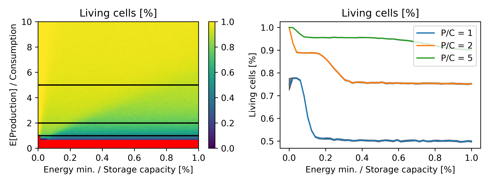
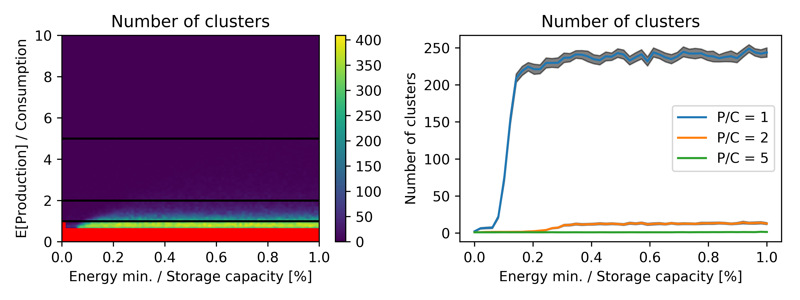
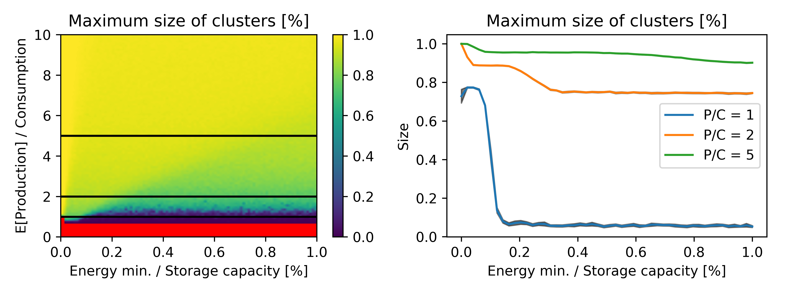
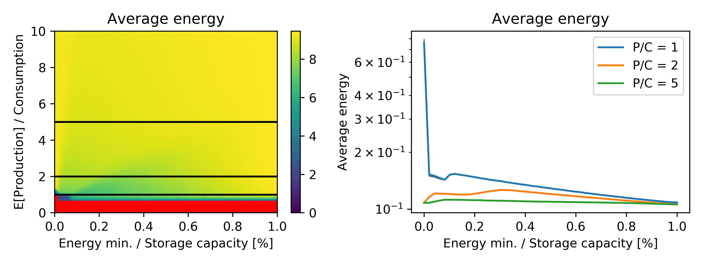

On this page we will describe our approach of the model on a cellular automaton. For a small introduction to cellular automat, please read: http://mathworld.wolfram.com/CellularAutomaton.html

# Approach
Our cellular automaton consists of cells that are arranged in a 2 dimensional grid. Cells are either alive or dead, and are characterized by the following attributes: 
- Initial energy level (same for each cell)
- Production function (different for each cell)
- Energy level (different for each cell)
- Solar panel capacity (different for each cell)
- Number of living neighbours (differnent for each cell)

In every time step, each living cell:
1. Produces energy based on the unique production function and time
2. If the energy exceeds a predetermined level, it evenly allocates this surplus amond its direct neighbours (maximum four). If it has 4 neighbours, each gets 25% of the surplus, if it has 3 neighbours, each get 33.33% of the surplus, etc. Energy level can't exceed the storage capacity.
3. The cells consumes energy, which is the same for all of them. If a cell runs out of energy, it dies. 
4. If a cell dies, its direct neighbours evenly share its solar panels, and use it later for production. We found that there is no big difference between the two approaches, because cells die at night, when they can't use the additional panels.

# Simluation settings
To study this system, we implemented the CA in Python and in C++ and experimented with different parameter setting, for eaxample: 
- Grid size: 50 x 50.
- Initial energy level: 0.05
- Maximum storage capacity: 10.0
- Days: 30
- Steps per day: 50
- Each cell has a unique production function A*sin(2*pi*t) where A follows the uniform distribution between 0 and 20. 

# Results
The results which are presented below, reveal some interesting properties of the system. (Dead cells are marked with red.) If the average production exceeds the consumption, the level of altruism increses the number of living cells. But, if the expected production is close to the consumption, at a very high altruism level, we find less cells alive than at a lower level of altruism. By further increasing selfisness, we cause a huge drop in the number of survivals. 

 

Selfisness generallly increases the number of clusters, but decreases their size. A higher production rate decreases the number as well, as it increaes the cluster size at the same time.

If production is more than conspumotion, the average energy per cell is maximized at a when the cells are a little selfish. 

<iframe width="560" height="315" src="https://www.youtube.com/embed/lQolYLWnwS8" frameborder="0" allow="autoplay; encrypted-media" allowfullscreen></iframe>
